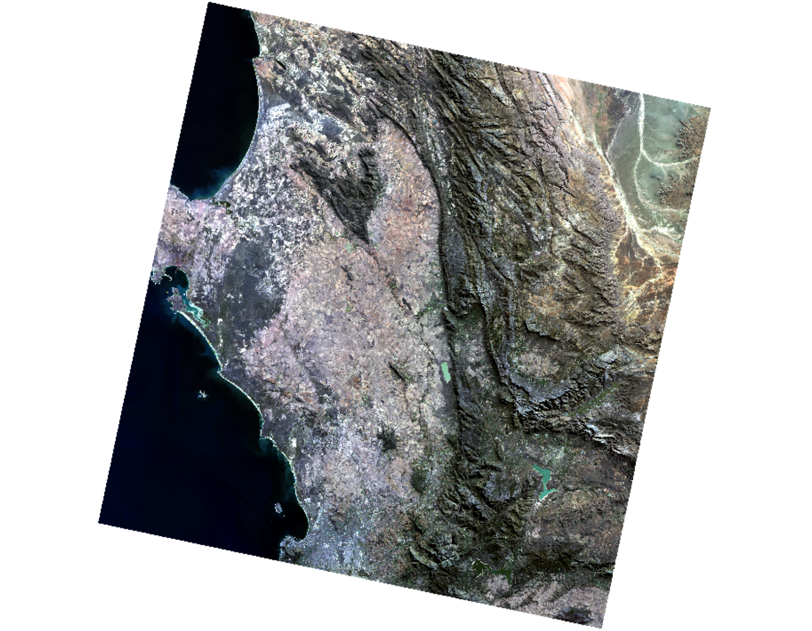
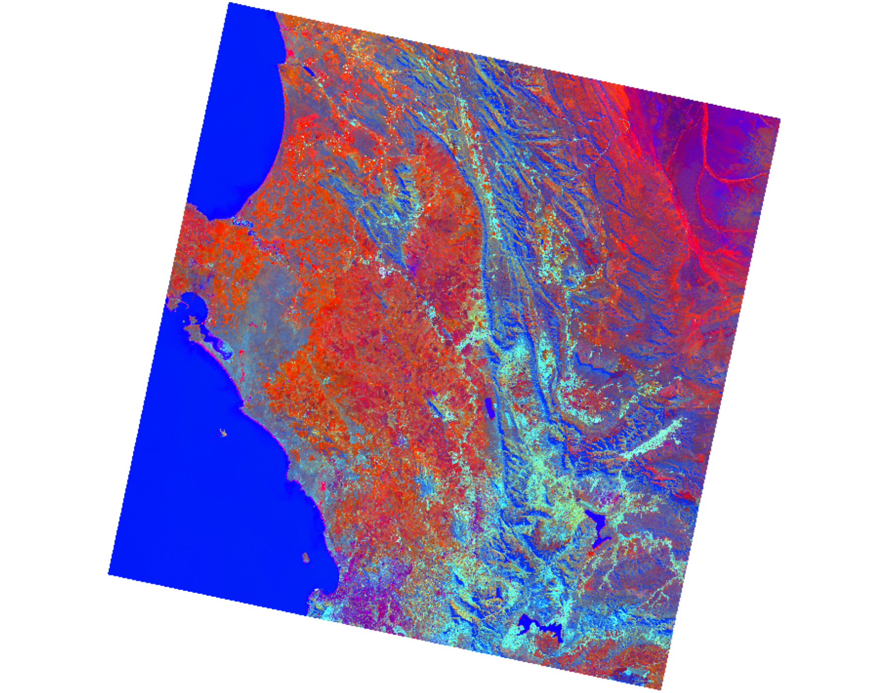
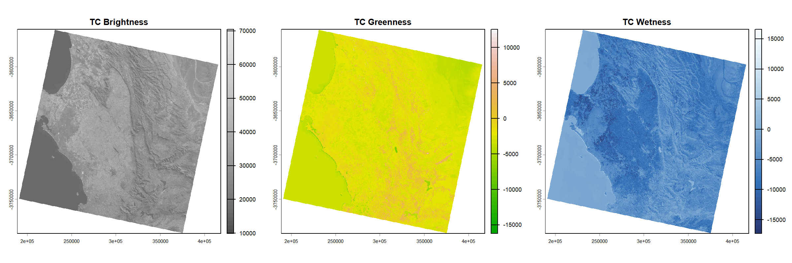
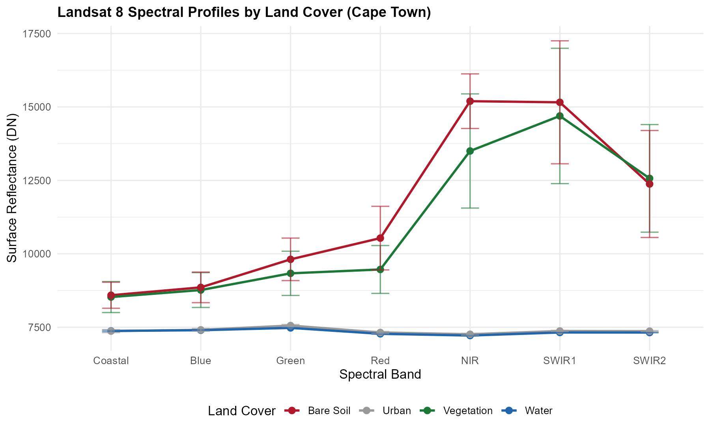

## Summary

This week was an introduction to remote sensing and Earth observation (EO). The core idea is simple: sensors on satellites measure electromagnetic radiation (EMR) that bounces off the Earth's surface, and we use that signal to understand what is on the ground. Passive sensors rely on sunlight, so they only work during the day and struggle with cloud cover. Active sensors like SAR send out their own microwave pulses, which means they can see through clouds and work at night [@kerle2004; @butcher2016].

One thing that clicked for me is why the sky is blue. Short blue wavelengths get scattered much more easily by atmospheric particles (Rayleigh scattering), while longer red wavelengths pass through. This same scattering is also why satellite images can look hazy, and why we need atmospheric correction. Sensors can only pick up signals within certain "atmospheric windows" where water vapour, ozone, and CO~2~ do not absorb the radiation [@jensen2016].

When choosing a sensor, there are four resolutions to think about: spatial which is pixel size, like 10 m for Sentinel-2 vs 30 m for Landsat, spectral which is how many bands the sensor records, temporal which is how often the satellite revisits, and radiometric which is how sensitive the sensor is to small differences in energy. In general, you cannot have everything. Higher spatial resolution usually means lower temporal frequency.

In the practical I used SNAP to look at Sentinel-2 imagery of West London and Landsat 8 imagery of Cape Town. The true colour composite (red, green, blue bands) looks like a normal photograph. The false colour composite puts near-infrared in the red channel, which makes vegetation appear bright red because of the strong NIR reflectance at the "red edge". Comparing the two sensors side by side, I could see that Sentinel-2's 10 m pixels pick up individual parks and street trees, while Landsat's 30 m pixels blur small green patches into the surrounding buildings.

{width="100%"}

{width="100%"}

{width="100%"}

Something useful I learned in SNAP is that histogram stretching only changes how the image looks on screen. It does not change the actual pixel values. So a nice-looking image is not necessarily better data [@jensen2016].

{width="100%"}

I also ran a Tasseled Cap Transformation on the Landsat data using the coefficients from Baig et al. [-@baig2014]. This reduces the spectral bands into three components: Brightness (built surfaces and bare soil), Greenness (vegetation), and Wetness (moisture). It is a useful way to compress the information into something more interpretable than raw bands.

{width="100%"}

{width="100%"}

Finally, I extracted spectral values from four land cover types (water, vegetation, urban, bare soil) using R to compare their signatures:

```{r}
#| eval: false
#| echo: true
library(terra)
library(tidyverse)

# Stack Landsat 8 SR bands B1-B7 and extract by land cover buffers
sr <- rast(list.files("Landsat/", pattern = "_SR_B[1-7]\\.TIF$",
                       full.names = TRUE))
# Create sample buffers for water, vegetation, urban, bare soil
# Extract pixel values per buffer, compute mean and SD per band
# Plot spectral profiles with error bars
```

{width="100%"}

The results match what the lecture described. Water absorbs almost everything and stays flat and low. Vegetation has the expected red edge jump from red to NIR. Bare soil reflects broadly. Urban areas sit somewhere in the middle with a fairly flat curve. It is one thing to hear about spectral signatures in a lecture, but seeing them come out of real data makes the concept much more concrete.

## Applications

```{r}
#| echo: false
#| message: false
#| warning: false
library(knitr)
sensor_tbl <- data.frame(
  Sensor = c("Sentinel-2 MSI", "Landsat 8/9 OLI-TIRS"),
  Spatial = c("10-60 m", "30 m (thermal 100 m)"),
  Temporal = c("5 days", "16 days"),
  Strength = c("Fine spatial detail for street-level vegetation mapping",
               "Long archive (1972-present) and thermal band for LST"),
  Limitation = c("No thermal band; cloud-prone in the UK",
                  "30 m pixels mix small parks with built surfaces")
)
kable(sensor_tbl, caption = "Table 1. Sentinel-2 and Landsat 8 comparison for urban EO applications.")
```

One area where this week's content directly applies is urban greenness mapping. Robinson et al. [-@robinson2022] calculated NDVI from Sentinel-2 across Great Britain and found that more deprived neighbourhoods tend to have less green cover. Their approach works because vegetation reflects strongly in near-infrared, so NDVI can separate green surfaces from buildings and roads. But even at 10 m, individual street trees or small gardens can get mixed into a single pixel, and the authors note that NDVI cannot tell the difference between tree canopy and grass, which provide quite different benefits.

Venter et al. [-@venter2020] took this further in Oslo by combining Sentinel-2 NDVI with Landsat surface temperature data. They found that greener neighbourhoods were cooler in summer, and that both tree cover and vegetation greenness were negatively related to land surface temperature. What I found interesting is how they used the strengths of each sensor together: Sentinel for vegetation detail, Landsat for thermal data. The main limitation was cloud. Over five summers, they could only use 15 to 20 clear scenes.

On the thermal side, Deilami et al. [-@deilami2018] reviewed 75 urban heat island studies and pointed out that most of them rely on a single Landsat image, which only captures mid-morning temperature on one day. This introduces obvious bias. Multi-date composites help, but they average across different weather conditions. The London Datastore product shows why this matters in practice [@majorsu]. For somewhere like West London, this means any heat analysis should use multiple years of data and ideally be checked against ground-level temperature records.

{width="25cm" height="8cm"}

## Reflection

Before this week I basically thought of satellite images as photos. Now I understand they are measurements of reflected energy at different wavelengths, and that what you see on screen depends on which bands you display and how you stretch the histogram. It sounds obvious when I write it down, but it was a genuine shift in how I think about the data.

SNAP was not the most pleasant software to use. The interface is clunky and the Sentinel file structure is confusing. But I do see why we used it: loading Sentinel-2 and Landsat side by side made the difference between 10 m and 30 m resolution real. I could zoom into a park and see trees in Sentinel that were just a blur in Landsat. That is harder to appreciate from a textbook.

The thing I keep coming back to from the readings is the gap between what satellites can measure and what a city council actually needs to make decisions. NDVI can show which neighbourhoods lack green cover, but planting trees also requires knowing who owns the land, what the soil is like, and what residents want. Remote sensing gives useful evidence, but it is not the whole answer [@londone]. I want to keep thinking about this as we go through the module. For next week I plan to set up the Quarto portfolio and make sure everything is version-controlled properly.
