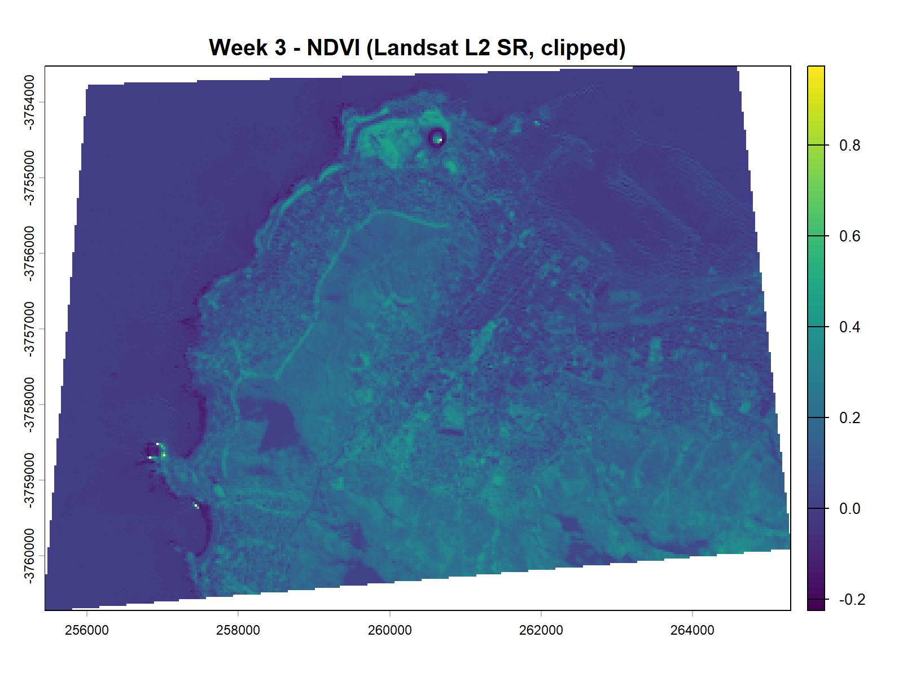
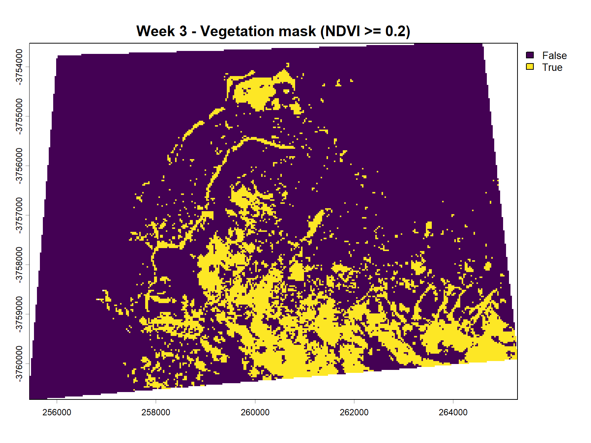
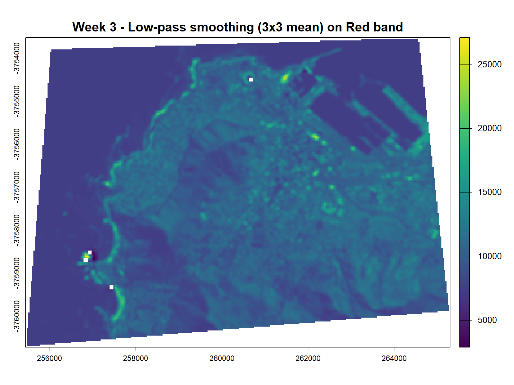
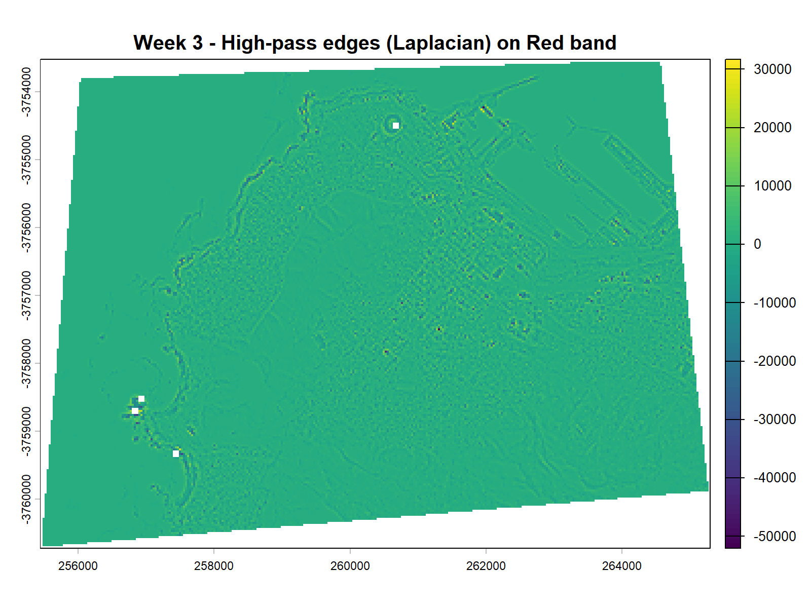
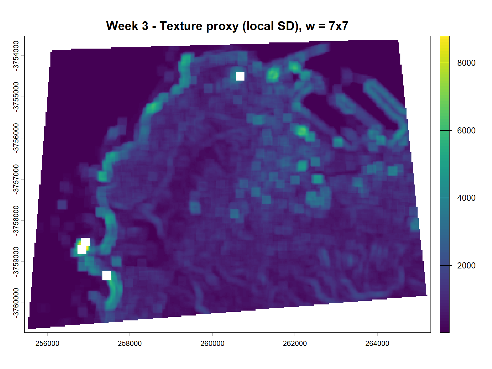
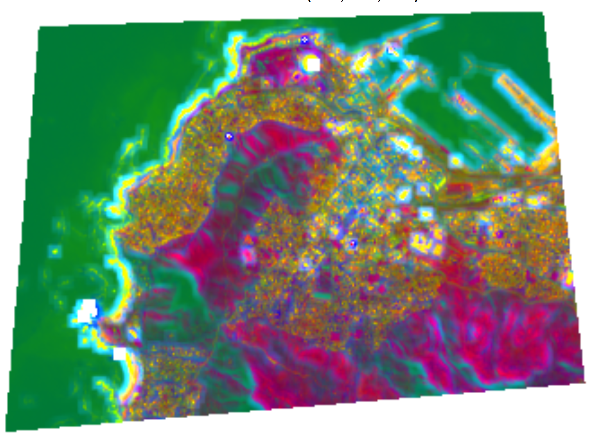

## Summary

This week was about corrections and enhancement, and it made me think less about satellite images as pictures and more as measurements. The main lesson was not to memorise every formula. It was to understand why two images of the same place can look different even when the land surface has not changed. The lecture grouped the main problems into geometric, atmospheric, topographic and radiometric correction. In simple terms, corrections try to make the image line up properly in space and make pixel values more comparable through time [@jensen2016; @radiativ2013].

![NASA HLS example comparing top-of-atmosphere reflectance on the left with surface reflectance after atmospheric correction on the right. The corrected image is less hazy and the contrast between vegetation, bare ground and built surfaces is clearer. Source: NASA HLS [@hlsatcorr].](https://hls.gsfc.nasa.gov/wp-content/uploads/2018/10/AC_LaSRC_example.jpg.jpeg){#fig-week3-atcorr width="100%"}

@fig-week3-atcorr made the value of atmospheric correction much easier to understand than the equations alone. The surface reflectance image is easier to read because it reduces atmospheric effects and makes the surface signal more stable. That also explains why the practical workbook and lecture pushed us towards analysis-ready data. In current workflows, the more realistic starting point is usually Collection 2 Level 2 surface reflectance rather than raw digital numbers. But this does not make correction irrelevant. It means I still need to know what product I am using, what processing has already happened, and whether it is fit for my research question [@ceosana; @landsat2022].

![USGS example of Collection 2 products from the same Landsat scene: top-of-atmosphere reflectance, surface reflectance and surface temperature. This is a useful reminder that "Landsat data" is not one single product. Source: USGS [@landsat2022].](https://d9-wret.s3.us-west-2.amazonaws.com/assets/palladium/production/s3fs-public/thumbnails/image/Collection2_samples_3PANEL_022031_20200916_v4.png){#fig-week3-products width="100%"}

For the practical I used Landsat Collection 2 Level 2 surface reflectance for a small study area in Cape Town. I kept the area small because texture measures can become computationally expensive very quickly. My first problem was actually basic GIS housekeeping rather than remote sensing: the study area shapefile had no coordinate system. I assigned WGS84 and then reprojected it to the Landsat grid before cropping and masking. That was a useful reminder that image analysis can fail for simple metadata reasons before any advanced method starts.

::: {layout-ncol="2"}
{#fig-week3-ndvi}

{#fig-week3-vegmask}
:::

I started with NDVI because it is the clearest example of ratio-based enhancement. It gave a quick first split between greener mountain and park areas and non-vegetated surfaces. I then turned that into a vegetation mask using a threshold of 0.2. The result is easy to read, but it also shows one weakness of threshold methods: bright soil, sparse vegetation and shadow can all complicate the interpretation [@jensen2016].

::: {layout-ncol="2"}
{#fig-week3-smooth}

{#fig-week3-edges}
:::

After that I tested two spatial filters on the red band. The low-pass filter reduced local noise, while the high-pass filter made the coastline and sharper land-cover boundaries stand out more clearly. I also calculated a 7 by 7 local standard deviation as a simple texture layer and then combined that with the spectral bands in a PCA. This gave a clearer visual separation between smoother water surfaces, greener mountain slopes and more heterogeneous built-up areas.

::: {layout-ncol="2"}
{#fig-week3-texture}

{#fig-week3-pca}
:::

## Applications

Corrected reflectance matters most when a study compares images across dates or across sensors. If atmospheric effects stay in the data, a change in pixel values may reflect haze or illumination differences rather than real land-surface change. That is one reason Level 2 surface reflectance products are widely used in environmental monitoring [@landsat2024]. A Cape Town drought study by @orimoloye2019 is a good example because it uses Landsat-derived vegetation information to map spatial patterns of stress. That kind of result only makes sense once the input reflectance is reasonably comparable across the study area and through time.

Enhancement methods are then used to turn corrected imagery into features that better match the research question. NDVI is a quick way to separate greener surfaces, but cities are spectrally messy and one pixel often mixes roofs, roads, shadow and vegetation. This is why urban studies often combine simple indices with filters, texture or other derived layers [@faridatul2018]. The fusion idea is also broader than my small practical example. @schultetobuhne2018 show that combining datasets or feature types can improve monitoring when one source alone is not enough. In my case, adding texture before PCA made the built fabric look more distinct, which suggests these layers could become useful inputs for later classification rather than just better-looking maps.

## Reflection

This week made pre-processing feel more important than I expected. Before this, correction sounded like background work you do before the "real" analysis begins. Now I think it is part of the real analysis, because it shapes which differences in the image are meaningful and which are just artefacts of sensor, atmosphere or geometry. Starting from surface reflectance was sensible and efficient, but it would be easy to treat it as a black box if I did not understand what had already been done to the image.

The practical also showed that enhancement is never neutral. An NDVI threshold of 0.2, a 3 by 3 filter, or a 7 by 7 texture window all produce slightly different stories about the same place. That is why I think the next useful step is not simply adding more outputs, but testing sensitivity and then carrying the best layers into a classification or change-detection task. For me, that would make the workflow feel less like image manipulation and more like a proper analytical process.
