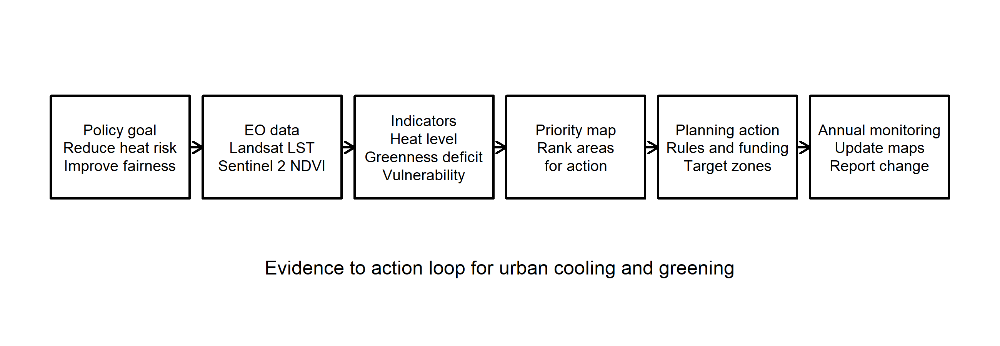

## Summary

What made it different from the earlier weeks is that it stopped treating Earth observation as the final product. Instead, the lecture kept asking where satellite data might fit inside a real planning process. That changed the question from "what can we map?" to "what decision could this map support?" I found that much more useful than a broad list of applications, because it made me think about who would use the output and what they would actually do with it.

![NASA ECOSTRESS image of ground surface temperatures in London on 15 July 2022, just before midnight. The persistence of high surface temperatures long after sunset makes the urban heat problem feel much more concrete than a generic temperature chart. Source: NASA/JPL-Caltech [@nasaecostresslondon2022].](img/week4/week45_nasa_ecostress_london.jpg){#fig-week45-ecostress width="90%"}

I chose London and urban heat as my case study. Heat felt like the clearest policy example because it already sits inside the London Environment Strategy and the city's wider resilience agenda [@londone], and there is already a public Landsat-based heat product through the London Datastore [@majorsu]. That means the challenge is not proving that heat exists. It is deciding how EO can help target action more clearly. I think the most useful starting point would be Landsat land surface temperature for screening hotspots, supported by Sentinel-2 NDVI to show where low greenness might be contributing to heat [@venter2020]. That is a much more policy-facing use of EO than simply making another temperature map.

::: {layout-ncol="2"}
![Major summer daytime heat spots across Greater London from the London Datastore. This is a good example of EO already being used to communicate a city-wide policy problem rather than only a technical remote sensing result. Source: Greater London Authority [@majorsu].](img/week4/week45_london_heatspots_gla.webp){#fig-week45-hotspots}

{#fig-week45-workflow}
:::

The two images above make the case quite clearly. The GLA map shows that summer heat is not evenly distributed across London, while the workflow figure shows how that evidence could move into planning action (@fig-week45-hotspots; @fig-week45-workflow). The main limitation is also clear. Satellite temperature is land surface temperature, not the air temperature a person actually feels in a room, at a bus stop, or in a street canyon. That means EO is very useful as a screening layer, but it is not enough on its own to describe heat-health risk [@deilami2018]. In policy terms, it should guide attention rather than pretend to settle the whole problem.

## Applications

What makes this more than just another urban heat map is the way the data could move through the planning system. A London-wide thermal layer could be summarised by borough, ward, school site, or another practical geography and then turned into a priority list for intervention. That would make it easier to direct greening budgets, shade projects, cool roof pilots, or design guidance reviews to the places that stay hottest. This is the part the lecture kept returning to: a spatial result becomes more useful once it helps answer "what next?" rather than merely showing that a pattern exists. @maclachlan2021heat is especially relevant here because it moves beyond detecting heat and asks how spatial evidence can improve the placement of cooling measures. In that sense, the main value of EO is not novelty. It is repeatability. The same summer workflow can be rerun each year and compared over time in a way that is much easier to connect to policy monitoring than a one-off academic map.

This case also links clearly to the global agendas discussed in the lecture. SDG 11 and the New Urban Agenda are both about safer, more resilient and more inclusive cities, while the Beat the Heat handbook goes a step further by explicitly treating EO heat mapping as part of a city's baseline evidence for action [@unep2021]. That creates a useful policy ladder: global agendas define the broad commitment, metropolitan policy interprets it for London, and EO helps decide where limited local action should begin. The equity side matters here as well. Studies from the United States show that hotter neighbourhoods often overlap with lower tree cover and worse social vulnerability [@li2022redlining; @nowak2022]. I would not copy that argument straight onto London, because the history is different, but it is still a useful warning. A city should not only ask where the hottest pixels are. It should also ask who is least able to cope with that heat.

## Reflection

This week made remote sensing feel more realistic to me because the main question was not about classification accuracy or image processing. It was about whether a planning team could actually use the result. For London, the technical side is probably not the biggest barrier. The harder part is deciding the unit of action. Should policy focus on the hottest boroughs, the hottest estates, schools with the least shade, or places where heat overlaps with deprivation and poor housing quality? EO helps with the first question much more than the others unless it is combined with non-EO data. That seems to be the real lesson from the lecture.

If I took this further into the group assessment, I would keep London and urban heat but be careful not to oversell what satellites can do. A yearly Landsat heat screen, supported by Sentinel-2 greenness data and then linked to vulnerability information, feels realistic and useful. That seems to match the wider point of the lecture: EO becomes most valuable when it enters a routine policy workflow rather than ending as a one-off academic map.
