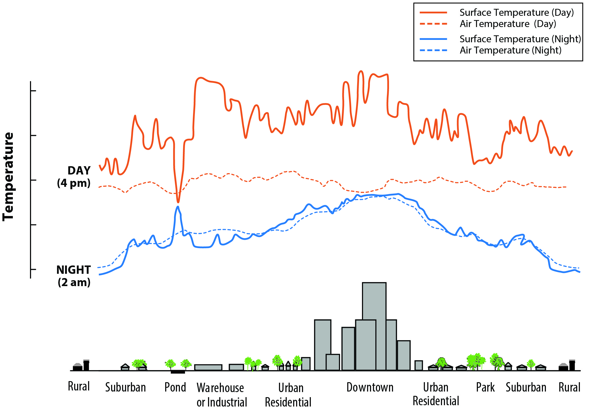

## Summary

This week covered how Earth observation connects to policy. Lecture was a broad survey of EO applications, and zoomed in on urban heat. The general message from lecture 4 is that EO can support many policy areas: urban expansion, forest monitoring, flood mapping, air pollution, drought, and disaster response. For each of these there is usually a straightforward technical workflow. Urban expansion can be tracked with multi-temporal Landsat classification, as in the Perth example where growth followed the mining boom. Floods can be mapped quickly using SAR backscatter because water absorbs the radar signal and appears dark. Forest loss can be detected at global scale, as @hansen2013 showed using 12 years of Landsat data and a decision tree classifier. Drought stress can be picked up through vegetation moisture indices. One hobby project during the California drought even used NDVI to spot residents who were watering their gardens illegally. The technical side is often not the hard part.

```{mermaid}
%%| fig-cap: "EO applications covered and their policy relevance"
%%| label: fig-eo-apps
flowchart LR
  A[Earth Observation Data] --> B[Urban Expansion<br/>Landsat multi-temporal]
  A --> C[Flood Mapping<br/>SAR backscatter]
  A --> D[Forest Monitoring<br/>Decision tree classifier]
  A --> E[Drought / Fire<br/>Vegetation indices]
  A --> F[Urban Heat<br/>LST from thermal bands]
  B & C & D & E & F --> G{Policy Gap:<br/>Most studies stop here}
  G -.-> H[Who acts on this?<br/>What decision does it support?<br/>Who funds the response?]
```

What struck me more was the gap the lecture kept highlighting between producing a map and actually changing a policy decision. Several studies were discussed that identify a spatial pattern (heat inequality linked to historical redlining, forest loss hotspots, flood exposure) but then stop short of saying what to do about it. The redlining and heat study found that historically disadvantaged neighbourhoods have higher land surface temperatures and more heat-related hospital visits, yet the paper barely mentions policy. This pattern kept coming up: solid spatial analysis, weak policy link.

Lecture 5 narrowed in on urban heat islands specifically. UHI comes mainly from dark impervious surfaces and lack of vegetation, and the costs are real. Melbourne estimated around \$300 million a year from health, energy, and transport impacts alone. The Beat the Heat handbook [@unep2021], produced after COP26 in Glasgow, was the first full guide on addressing urban heat for local planners. It covers strategies from simple cool roofs to complex district cooling systems, with rough assessments of cost and human resource requirements. What I found useful is that it explicitly includes EO-based heat mapping as part of the baseline assessment, which makes it one of the first major policy documents to do so.

{#fig-uhi-profile}

{#fig-nasa-buffalo}

## Applications

@hansen2013 demonstrated the scale that EO analysis can reach by processing over 650,000 Landsat scenes to map global forest loss and gain between 2000 and 2012. They derived spectral metrics from the raw bands (percentile reflectance values, mean reflectance, band regression slopes) and fed these into a decision tree classifier. The dataset is openly available and updated annually, so in theory any country can monitor deforestation without building its own system. But as the lecture pointed out, a global forest loss layer does not automatically tell a government where to send enforcement or how to prioritise limited funding. The data answers "where" but not "what next", and that gap is where most studies stop.

The same disconnect appears in urban heat research. @venter2020 combined Sentinel-2 NDVI with Landsat surface temperature in Oslo and found that greener neighbourhoods were 2 to 3 degrees cooler in summer, with lower-income areas missing out on this cooling benefit. This is a clear equity finding, but translating it into a planting programme requires knowing land ownership, soil conditions, community preferences, and budget, none of which come from a satellite. @deilami2018 reviewed 75 UHI studies and found that most rely on a single daytime Landsat image, which only captures mid-morning conditions on one day. Heat stress actually peaks in the afternoon and evening, so a single snapshot can misrepresent where the worst exposure is. If a city uses that data to decide where to plant trees or install cool surfaces, the priorities could shift depending on when temperature is measured.

```{mermaid}
%%| fig-cap: "Policy hierarchy: from global frameworks to local delivery, and where EO data could plug in"
%%| label: fig-policy-layers
flowchart TD
  G["Global Frameworks<br/>(New Urban Agenda, SDGs, Sendai)"] --> M["Metropolitan / National Plans<br/>(London Plan, Singapore Green Plan)"]
  M --> L["Local Councils<br/>(actual delivery, limited budgets)"]
  EO["EO Data<br/>(consistent, repeatable, global)"] -.-> G
  EO -.-> M
  EO -.-> L
  L --> P{{"Problem: who processes<br/>the data at this level?"}}
```

The lecture also walked through how policy is layered. Global agendas like the New Urban Agenda and the SDGs set broad commitments, metropolitan plans turn them into local targets, and councils are left to deliver. A recurring problem is that SDG indicators rely on national statistics collected in different ways, making cross-country comparison unreliable. EO could help by providing consistent measurements, but uptake is slow. The Beat the Heat handbook [@unep2021] tries to bridge this by giving planners a practical starting point that includes satellite heat mapping. It is still broad, but it goes further than the usual "we commit to sustainable cities" language in most framework documents.

## Reflection

The thing that stuck with me most is how often the chain breaks between analysis and action. I kept expecting the case studies to end with a concrete recommendation, like target this neighbourhood or change this planning rule, but most just conclude that a spatial pattern exists. The Cape Town example from the lecture made this even more real. Even when useful data existed, government departments would not share it because they lacked a data sharing agreement. The bottleneck was not technical capacity but institutional coordination.

This connects to what I wrote in week 1 about the gap between what satellites can measure and what a council actually needs. A few weeks later I think the gap is wider than I expected, because it is not just about spatial resolution or cloud cover. It is about whether anyone in a planning team knows the data exists, has time to process it, and has the authority to act on the results. For my own work I want to keep asking who the user of the output is and what decision it supports, rather than just producing a technically sound map. I am also curious about cities that have actually built EO into routine planning workflows, what institutional setup made that possible, and whether it survived beyond the initial project funding.
