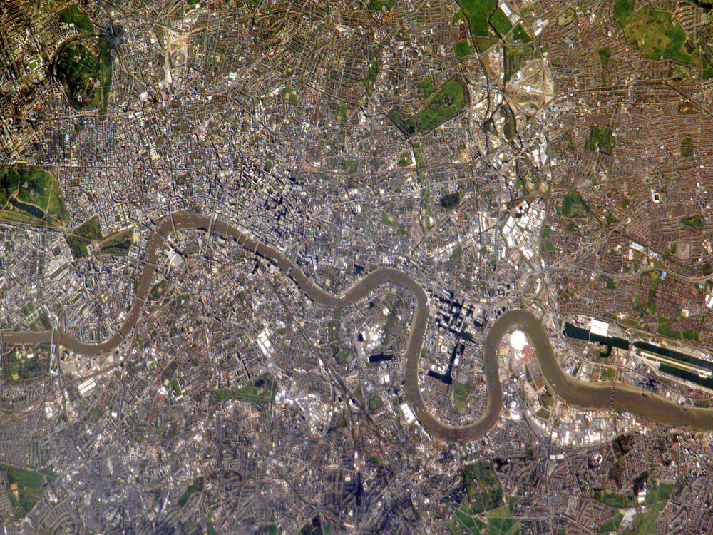
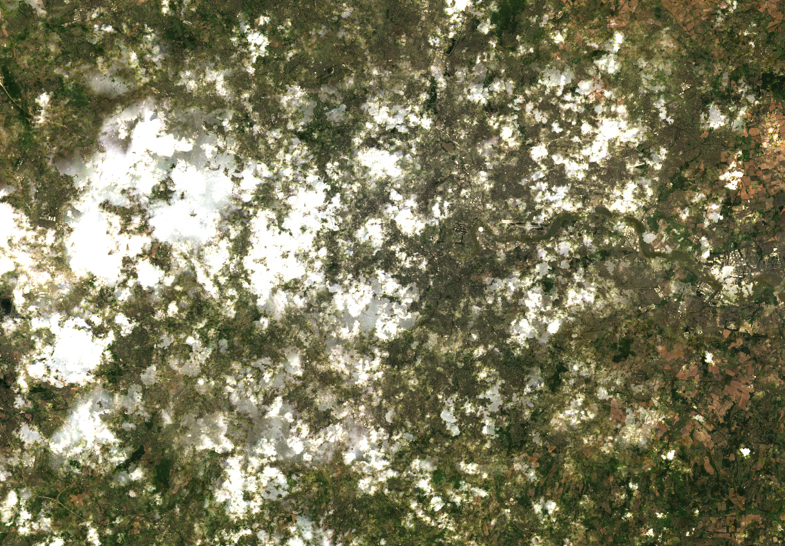
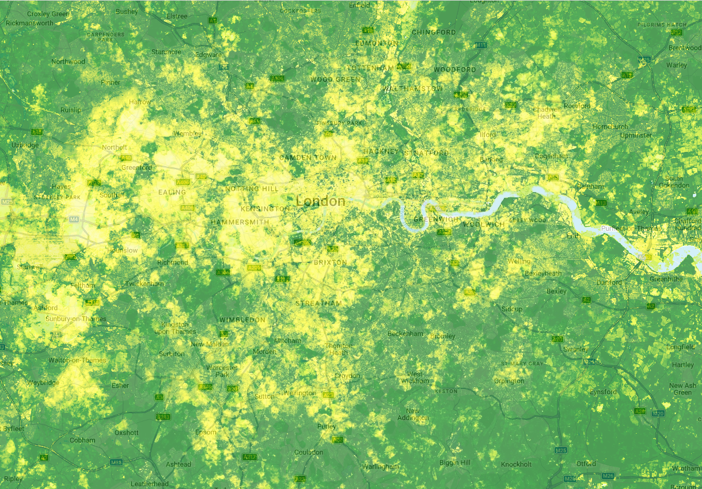
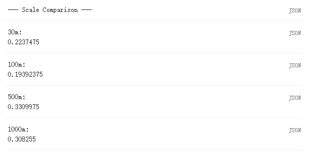

## Summary

This week introduced Google Earth Engine (GEE) as a cloud platform for remote sensing. Instead of downloading scenes to my own computer, I write JavaScript in the browser and send instructions to Google's servers, where the imagery is stored and processed [@gorelick2017]. After weeks of working in SNAP and R, this felt like a real change in workflow. Much of the time that used to go into finding, downloading and preparing images can now be reduced to a short script.

The key idea from the lecture was the difference between client and server. In GEE, anything that starts with `ee` is a server-side object, not data sitting inside the script. That is why `map()` is more useful than a normal `for` loop. The lecture also kept coming back to `filter`, `scale`, `reducer` and `join`. `filterDate()` and `filterBounds()` cut an image collection down to the scenes I need. Reducers such as `median()` or `mean()` turn many images or many pixels into something smaller and easier to analyse. `Join` links collections by attribute or location. The point that stayed with me most, though, was `scale`. It is not just about how the map looks on screen. It changes the values returned by the analysis because GEE resamples to the output resolution. In my own test on one London point, the NIR value changed from 0.578 at 30 m to 0.509 at 1000 m, which made the effect very concrete (@fig-scale).

For the practical I built a summer 2025 Landsat 9 NDVI composite for London (@fig-truecolour; @fig-ndvi). I filtered the collection by date and location, applied the Collection 2 scale factors, took a median composite, clipped it, and then calculated NDVI (@fig-gee-workflow). The median composite was a sensible choice here because I wanted one clean image rather than a single scene with cloud or seam problems. The NDVI map behaves as expected: large green spaces such as Richmond Park and Hampstead Heath stand out clearly, while dense built-up areas are lower. I used a simple bounding rectangle because this was an introductory exercise and I wanted to focus on the GEE workflow. For policy-facing work, I would replace the rectangle with a Greater London boundary.

{#fig-london-context width="85%"}

``` javascript
// Introductory London bounding-box ROI from Landsat 9
var london_bbox = ee.Geometry.Rectangle([-0.51, 51.28, 0.33, 51.69]);

var l9 = ee.ImageCollection('LANDSAT/LC09/C02/T1_L2')
  .filterDate('2025-06-01', '2025-09-01')
  .filterBounds(london_bbox)
  .map(function(img){
    var opt = img.select(['SR_B1','SR_B2','SR_B3','SR_B4','SR_B5','SR_B6','SR_B7'])
                 .multiply(0.0000275).add(-0.2);
    return img.addBands(opt, null, true);
  });

var composite = l9.median().clip(london_bbox);
var ndvi = composite.normalizedDifference(['SR_B5','SR_B4']);

Map.setCenter(-0.118, 51.509, 10);
Map.addLayer(composite,
  {bands:['SR_B4','SR_B3','SR_B2'], min:0, max:0.3}, 'True Colour');
Map.addLayer(ndvi,
  {min:-0.1, max:0.7, palette:['white','yellow','green','darkgreen']}, 'NDVI');
```

::: {layout-ncol="2"}
{#fig-truecolour}

{#fig-ndvi}
:::

{#fig-scale width="70%"}

```{mermaid}
%%| fig-cap: "GEE workflow to London NDVI composite"
%%| label: fig-gee-workflow
flowchart LR
  A[ImageCollection<br/>Landsat 9] --> B[filterDate<br/>filterBounds]
  B --> C[.map scale factors]
  C --> D[.median .clip]
  D --> E[NDVI]
  E --> F[Map.addLayer<br/>or Export]
```

## Applications

@tamiminia2020 reviewed more than 300 GEE studies and found that land cover change, vegetation monitoring and hydrology were among the most common uses. That pattern makes sense because GEE is strongest when a project needs a long image archive and repeated pre-processing. @sidhu2018 used GEE to map land cover change in Singapore over three decades by combining Landsat scenes, temporal filters and classification. A workflow like that would still be possible in local software, but it would involve much more downloading, sorting and pre-processing before the real analysis even begins. GEE shifts more of the effort from data handling to method design.

Urban heat is another good fit. Cities need repeatable summer imagery, comparable outputs across years, and a way to combine temperature with land cover or greenness. London already has a Landsat-based map of major summer heat spots through the London Datastore [@majorsu], and broader urban climate research shows that greener neighbourhoods can reduce heat exposure and health risk [@venter2020]. GEE could support this kind of monitoring well, but the lecture also showed that fast processing does not remove basic analytical choices. Boundaries, scale, season and the exact definition of the indicator still matter. There is also the wider issue that GEE is controlled by one platform, which means convenience comes with dependence [@mutanga2019; @amani2020].

## Reflection

What I found most useful this week was not just that GEE is fast, but that it makes it easier to test an idea quickly. That matters for project work, because I can now screen a study area or build a first image product without spending most of my time preparing data. At the same time, this week also made me more cautious. GEE makes it very easy to produce a map that looks convincing, even when the boundary or scale is not quite right. For my own work, I can already see a sensible division of labour: use GEE to explore, subset and build quick image products, then move to R or Python when I need more control, clearer documentation or a more detailed model. That feels like the real lesson from this week.
