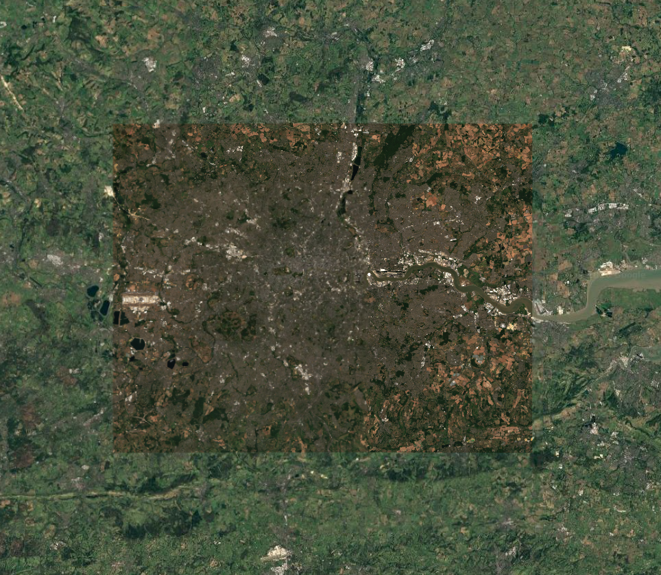
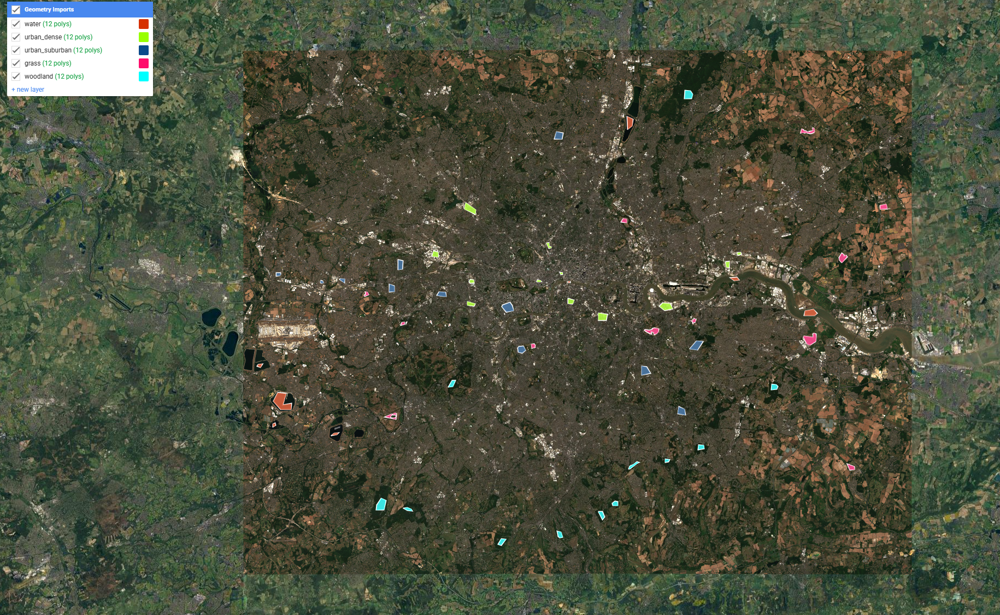
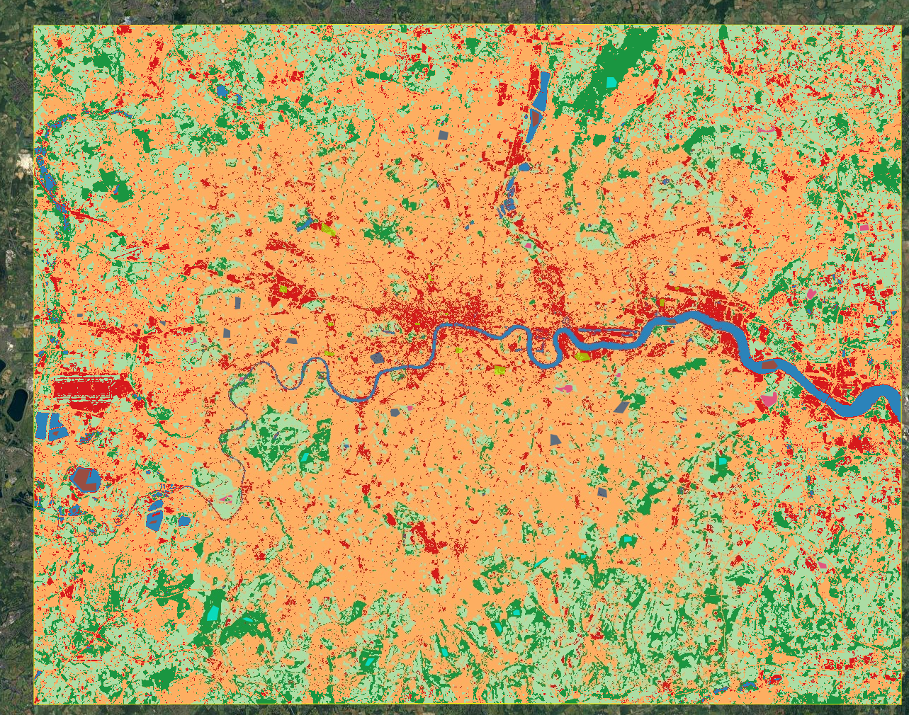
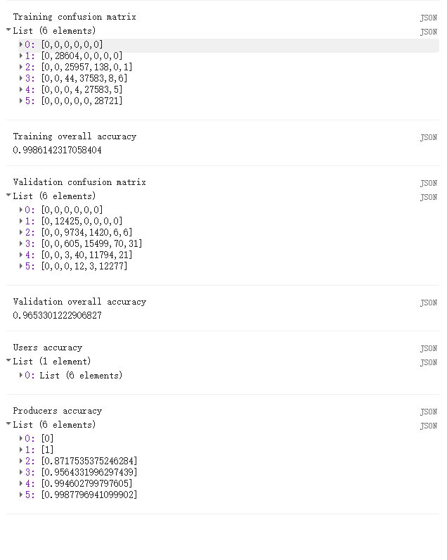

## Summary

This week was about classification, which is really just a way of turning a multispectral image into a map of land-cover classes. The lecture covered the basic logic first: decide what the classes are, collect training data, split the samples into training and testing sets, fit a model, and then assess how well it performs. It also made the difference between supervised and unsupervised classification much clearer. In supervised classification, the user decides what counts as water, grass or urban land and teaches the model with examples. In unsupervised classification, the algorithm groups pixels by similarity first and the interpretation comes afterwards. What stayed with me most, though, was the lecturer's warning that a classification should not be the end of the analysis. A land-cover map only becomes useful when it supports a larger question, such as urban heat, pollution, flooding or access to green space.

![A generic example of land-cover mapping workflow, from source imagery to segmentation, rules and final classified output. Although the example is not London, it captures the same broad logic used in this week's practical. Source: Wikimedia Commons [@wikimedialcmapping].](img/week7/week7_land_cover_mapping_process.jpg){#fig-week7-workflow width="100%"}

For the practical I kept the same London bounding box used in week 6, but this time I moved from Landsat NDVI to a summer 2025 Sentinel-2 classification. That felt like a sensible step forward because Sentinel-2 has 10 m pixels, which are much better suited to urban land cover than Landsat. I built a cloud-masked median composite, then manually drew training polygons for five classes: water, dense urban, suburban urban, grass and woodland (@fig-week7-truecolour; @fig-week7-training). After that I sampled six bands (`B2`, `B3`, `B4`, `B8`, `B11`, `B12`), split the sampled pixels into a 70/30 training-validation set, and trained a random forest classifier with 100 trees. What I liked about this practical is that it made classification feel less abstract. Drawing the polygons forced me to think about where a class really begins and ends, especially in suburban London where roofs, trees, gardens and roads are often mixed together in a very small area.

The resulting map captures the main structure of London quite well. The Thames and reservoirs stay stable as water, the dense urban core stands out in central London, and the larger parks and woodland patches are easy to spot in the surrounding urban fabric (@fig-week7-rf). The accuracy statistics were also very high, with a training accuracy of 0.986 and a validation accuracy of 0.965 (@fig-week7-accuracy). On paper that looks excellent, but I do not think it should be taken at face value. The main confusion is between dense urban and suburban urban, which makes sense because those classes are spectrally closer than water or woodland. More importantly, I split the data at pixel level within the sampled polygons, so the test pixels were still spatially close to the training pixels. Since nearby pixels tend to be similar, this probably inflates the apparent validation performance [@karasiak2022]. In that sense, the practical also sets up the logic for next week: if pixel-based classification creates patchy outputs and optimistic accuracy, then object-based or softer approaches start to look much more appealing.

::: {layout-ncol="2"}
{#fig-week7-truecolour}

{#fig-week7-training}
:::

``` javascript
var rf = ee.Classifier.smileRandomForest({
  numberOfTrees: 100,
  seed: 7
}).train({
  features: training,
  classProperty: 'class',
  inputProperties: predictors.bandNames()
});

var classified = predictors.classify(rf);
var validated = validation.classify(rf);
var testCM = validated.errorMatrix('class', 'classification');
```

{#fig-week7-rf}

{#fig-week7-accuracy width="60%"}

![A clearer example of how a confusion matrix can be read alongside overall accuracy and class-wise user's and producer's accuracy. This is much closer to the logic behind the Earth Engine output used in the practical. Source: Wikimedia Commons [@wikimediaconfmatrix].](img/week7/week7_confusion_matrix_land_cover.jpg){#fig-week7-accuracy-framework width="75%"}

## Applications

Random forest is widely used in remote sensing because it handles many predictor variables well, does not rely on strong distributional assumptions, and usually performs strongly without the user having to tune too many parameters [@belgiu2016]. That helps explain why it works so well in a practical like this one. Even with manually drawn training data and a spectrally messy city, it can still produce a convincing result. But the literature also makes it clear that a high accuracy score does not automatically mean the method is the best fit for the problem. Recent reviews of land-cover classification with high-resolution imagery make a similar point: pixel methods can work well, but they often produce noisy boundaries, while object-based approaches can produce more coherent map units when spatial structure matters [@qinliu2022]. My London map shows exactly that trade-off. At city scale it is readable and useful, but the suburban fringe still looks patchy because each pixel is classified on its own rather than as part of a street block, park edge or neighbourhood unit.

The wider applications also support the lecturer's point that classification should lead into another question rather than stop at the map. @hansen2013 used classification methods to monitor forest cover change, but the broader value of that work was not just describing land cover. It supported large-scale monitoring of environmental change. In urban studies, @faridatul2018 used spectral information to classify major urban land covers, which is closer to what I did this week. A London land-cover map like mine would be most useful as an input into another analysis, such as urban heat, access to green space, flood exposure or the uneven distribution of environmental quality across neighbourhoods. That is probably the most important lesson I took from the readings. Classification is useful, but only if it is tied to a meaningful urban problem.

## Reflection

This week felt like a good example of why remote sensing workflows can look tidy in a lecture but messy in practice. Once I had to draw the training data myself, it became obvious that the hardest part was not the algorithm. It was deciding what counts as a pure class in a city where many surfaces are mixed by design. A suburban pixel in London can easily contain roof, road, grass and tree canopy all at once, so the clean boundaries implied by a classification map are often a simplification. That does not make the result useless, but it does change how I read it. I now see classification less as a neat final answer and more as a first layer that helps organise a more complicated urban question. If I extended this workflow, I would first make the validation more independent, and then test whether an object-based method could reduce the patchiness in the suburban fringe and produce something closer to how people actually interpret urban land cover.
