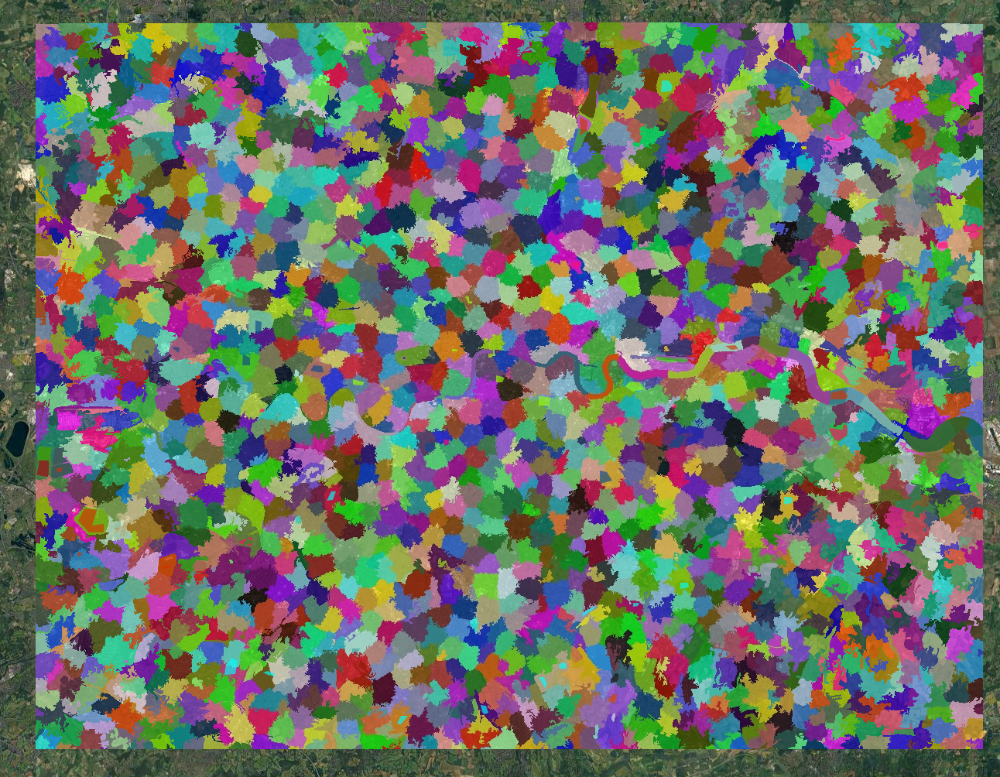
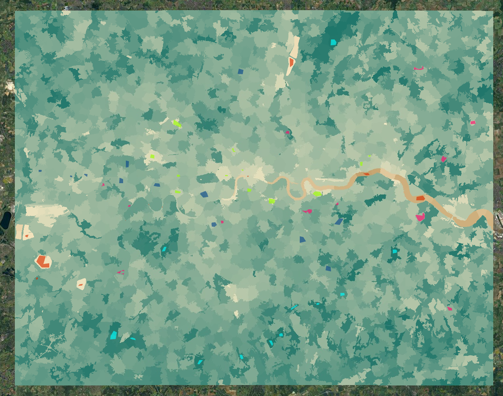
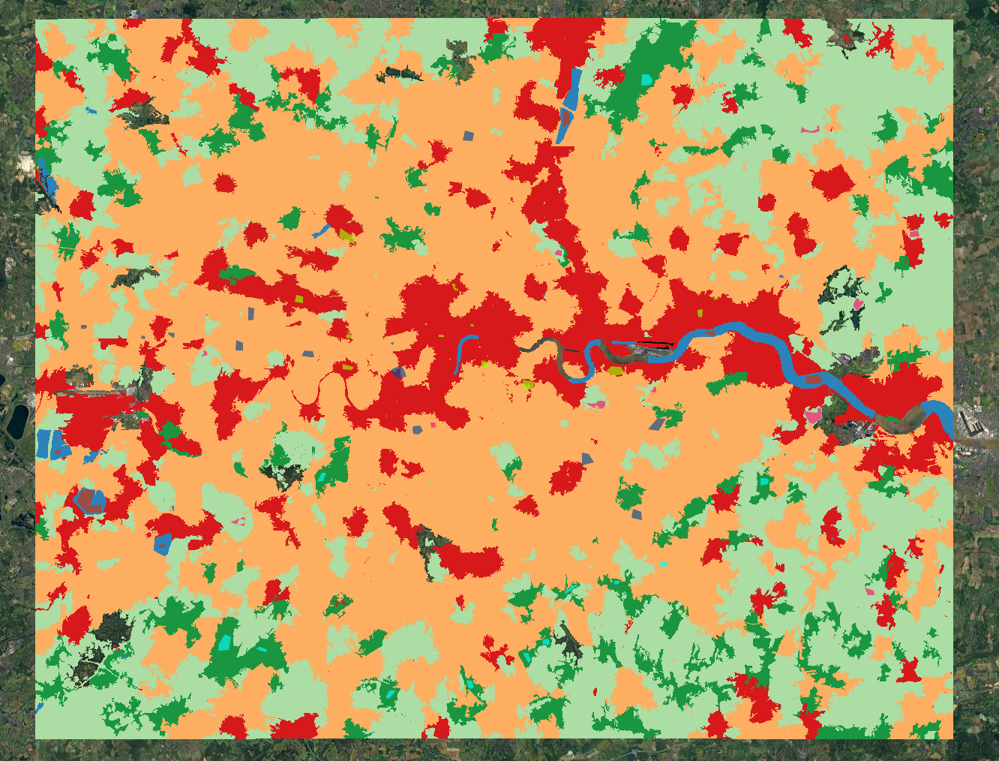
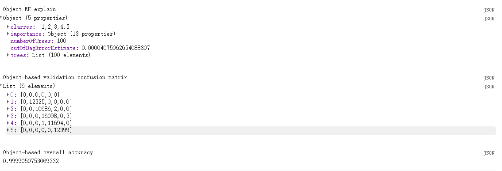

## Summary

This week felt less like learning a completely new method and more like learning why last week's map was only half the story. The lecture moved on from pixel-based classification and looked at pre-classified products, object-based image analysis (OBIA), sub-pixel methods, and the wider question of accuracy. The main thing I took from it is that urban pixels are messy. Even with Sentinel-2, a 10 m pixel can still mix roof, road, grass, tree canopy and shadow. That makes it very easy to produce a map that looks neat on screen but hides how mixed the ground really is. Seen from that angle, the doubt of ready-made products like Dynamic World it is make sense to me. They are useful if I want something quick, but at local urban scale they not 100% reliable.

::: {layout-ncol="2"}
![A generic illustration of object-based image analysis, where neighbouring pixels are grouped into larger units before interpretation. Source: Wikimedia Commons [@wikimediaobia].](img/week8/week8_object_based_image_analysis.jpg){#fig-week8-obia-concept}

![A simple mixed-pixel diagram. A single pixel can contain several land-cover types at once, which is exactly why hard urban classifications can be misleading. Source: Wikimedia Commons [@wikimediamixedpixel].](img/week8/week8_mixed_pixel.png){#fig-week8-mixed}
:::

For the practical I kept exactly the same London Sentinel-2 composite and training classes from week 7, but changed the unit of analysis. Instead of classifying raw pixels, I first used SNIC to split the image into objects and then calculated object-level predictors. That made the workflow feel like a proper continuation of last week rather than a separate task. The segmentation is not perfect, but it is already closer to how I would actually read the image myself: river corridors, park patches and larger built-up areas start to appear as units rather than as isolated cells (@fig-week8-snic; @fig-week8-ndvi).

::: {layout-ncol="2"}
{#fig-week8-snic}

{#fig-week8-ndvi}
:::

The final object-based random forest classification is much smoother than the week 7 pixel-based map. The Thames is cleaner, larger green spaces hold together better, and the suburban fringe looks less speckled, even if there is still some simplification at the edges (@fig-week8-rf). The accuracy output, however, is almost too good to be believable, with overall accuracy very close to 1 (@fig-week8-accuracy). I do not really see that as a success. If anything, it feels like a warning sign. I sampled object-based predictors from the same training polygons used last week, so nearby samples are still highly dependent and many pixels inside the same object share almost identical values. That makes the validation look much stronger than it probably is, which fits the lecture's wider point that accuracy needs to be interpreted carefully rather than just reported [@karasiak2022].

``` javascript
var snic = ee.Algorithms.Image.Segmentation.SNIC({
  image: predictors,
  compactness: 1,
  connectivity: 8,
  neighborhoodSize: 60,
  seeds: ee.Algorithms.Image.Segmentation.seedGrid(30, 'hex')
});

var objectNdvi = snic.normalizedDifference(['B8_mean', 'B4_mean']).rename('obj_ndvi');
var objectImage = ee.Image.cat([
  snic.select(['B2_mean', 'B3_mean', 'B4_mean', 'B8_mean', 'B11_mean', 'B12_mean']),
  objectNdvi
]).float();
```

{#fig-week8-rf}

{#fig-week8-accuracy width="65%"}

## Applications

What I liked in the readings is that OBIA is not just a tidier version of pixel classification. @maxwell2018 show that object-based approaches can do better when spatial structure matters, which is often the case in land-cover mapping with detailed imagery. @matarira2023 use an object-based workflow in Google Earth Engine to map informal settlements, where shape, texture and neighbourhood context matter just as much as spectral response. That felt very relevant to my London example. A park edge, housing estate or river corridor is usually read as a spatial unit, not as a collection of separate pixels, so OBIA often makes urban outputs easier to interpret and explain.

The sub-pixel part of the lecture pushed the same point in a slightly different direction. @foody2004 argues that mixed pixels are often unavoidable and that it can be better to estimate fractions than force a hard class label. That seems especially relevant in suburban London, where one pixel can easily mix canopy, garden, roof and road. At the same time, @karasiak2022 remind us that even a sophisticated map is not enough on its own if the validation design is weak. Taken together, the readings made this week feel less about finding the "best" classifier and more about choosing a method that actually fits the landscape and the question.

## Reflection

This week made me look back at my week 7 map quite differently. Last week I was mostly pleased that the classifier worked at all. This week made me ask whether it was working for the right reasons, which is probably a much more useful question. The object-based result is not automatically more truthful, but it is easier to read and it feels closer to how urban land cover is actually organised. If I carried this on, I would want to test a more independent validation strategy and maybe compare OBIA with a simple fractional cover approach in the suburban fringe, where mixed land cover is most obvious. That seems much more realistic than assuming every urban pixel belongs neatly to one class.
