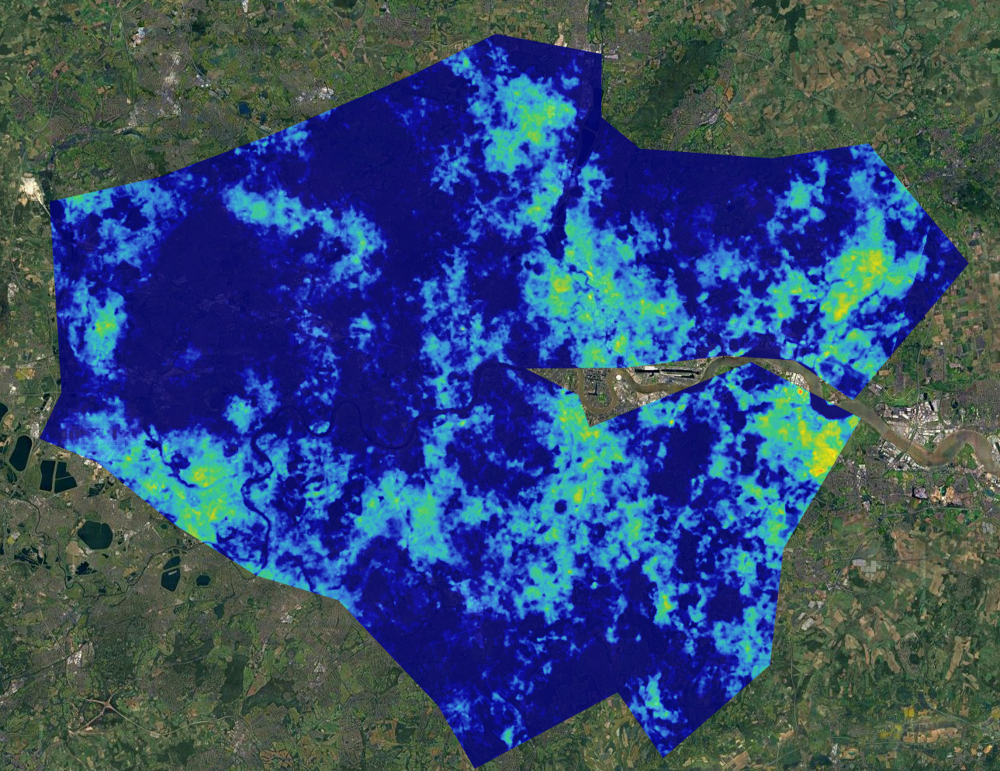
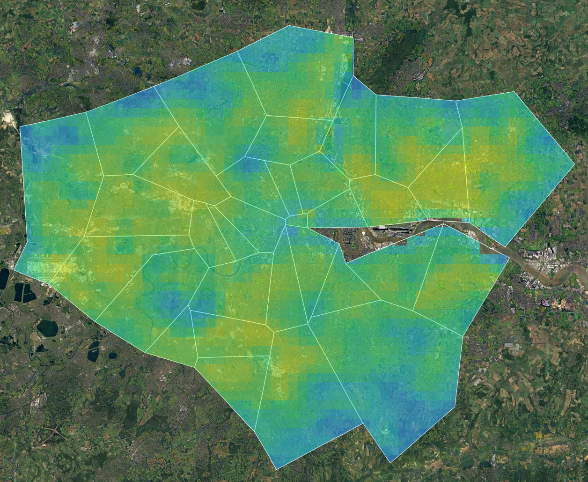
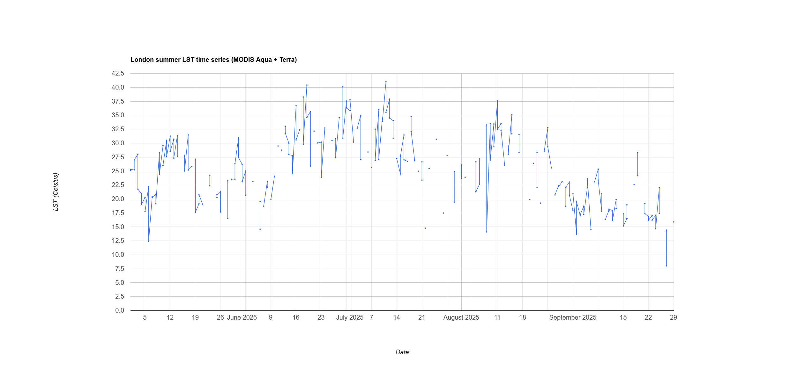
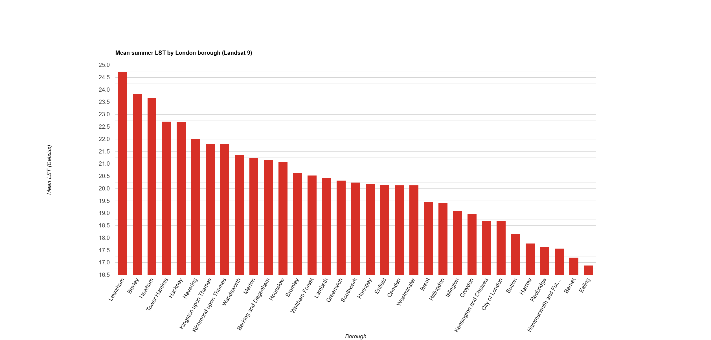

## Summary

This week felt much closer to a real urban problem than the previous classification practicals. Instead of asking how to make a cleaner land-cover map, the lecture asked why some parts of a city become hotter than others and what that means for planning. The distinction between land surface temperature (LST) and air temperature mattered a lot. Satellite thermal data are very good at showing hot surfaces, but they do not tell the whole story of what people actually feel on the street. That is why the lecture kept moving from temperature to tree cover, housing, inequality and environmental justice rather than treating heat as just another image product [@wilson2020; @klinenberg1999].

![NASA example showing how built surfaces retain more heat than vegetated areas. It is a simple image, but it makes the basic physical logic of urban heat islands very clear. Source: NASA Science [@nasaurbansurfaces2025].](img/week9/week9_nasa_urban_heat_surfaces.jpg){#fig-week9-nasa-heat width="70%"}

One thing I liked is that this week also pulled the previous practicals back into the story. The New York example below shows almost exactly why weeks 6 to 8 still matter: vegetation and land cover are not separate from heat, they are part of the reason heat is distributed unevenly in the first place. That made this week feel like a continuation rather than a new topic. The point is not just that greener areas are cooler, but that remote sensing can show that relationship spatially in a way that is useful for urban analysis [@nasanycvegetationtemp2025].

![NASA Landsat example for New York City showing vegetation on the left and temperature on the right. It is a useful reminder that greener surfaces often line up with cooler temperatures, which connects this week's heat analysis back to the NDVI and land-cover work from earlier weeks. Source: Robert Simmon using Landsat data [@nasanycvegetationtemp2025].](img/week9/week9_nasa_nyc_vegetation_temperature.png){#fig-week9-nasa-nyc width="85%"}

For the practical I kept the same London study area used in weeks 6 to 8, but shifted from Sentinel-2 reflectance and classification to thermal products. Following the logic of the official practical, I used Landsat 9 Collection 2 surface temperature to build a summer mean LST map, then used MODIS Aqua and Terra to make a coarser summer temperature surface and a city-level time series. Keeping London rather than switching to the Beijing example made the workflow feel much more coherent. It also made the strengths and weaknesses of the two sensors very obvious. Landsat is much better for showing internal variation across the city because the pixels are smaller, while MODIS loses that detail but gives much denser temporal coverage (@fig-week9-landsat; @fig-week9-modis).

::: {layout-ncol="2"}
{#fig-week9-landsat}

{#fig-week9-modis}
:::

The MODIS time series was probably the most useful output for me because it shows why a coarser sensor can still be worth using. Temperatures rise into July and early August, with several hot spikes above 35 Celsius, before generally falling back through September (@fig-week9-timeseries). The line is messy because Aqua and Terra contribute two daytime observations on many dates, but that also reflects the main strength of MODIS: repeated sampling. To make the analysis more relevant to planning, I also summarised the Landsat mean temperature by London borough rather than stopping at a pixel map. That step matters because a borough ranking is much closer to something a city could actually use, even if it also hides a lot of variation within each borough (@fig-week9-borough-chart).

{#fig-week9-timeseries}

``` javascript
var landsatLstMean = landsat.select('LST_C').mean().clip(greaterLondon);

var modisMerged = modisAqua.merge(modisTerra).sort('system:time_start');

var boroughLandsatMean = landsatLstMean.reduceRegions({
  collection: londonBoroughs,
  reducer: ee.Reducer.mean(),
  scale: 30
});
```

{#fig-week9-borough-chart}

## Applications

What stood out in the readings is that heat is often being used as a way to talk about much older planning decisions. @wilson2020 argues that urban heat management cannot be separated from the legacy of redlining because historically marginalised neighbourhoods often inherited less tree cover and more heat-absorbing surfaces. @nowak2022 supports that by showing lower tree cover and lower ecosystem service value in redlined areas across the United States. @li2022redlining then take the argument further by linking historical redlining, urban heat and heat-related emergency department visits across Texas cities. Read together, these studies show that a temperature map is not just a climate map. It is also a way of showing how uneven urban development can still shape present environmental risk.

At the same time, I do not think the US redlining literature should be copied straight onto London without caution. The histories are different. What is transferable is the wider point that heat exposure is socially produced as well as physically measured. That is why @maclachlan2021heat feels especially relevant. It moves from identifying hotspots to thinking about how planning and design choices could actually reduce them. @klinenberg1999 is a useful warning here too, because the Chicago heat wave became deadly not just because temperatures were high, but because heat interacted with age, poverty, isolation and uneven access to services. For my London practical, that means borough mean LST should be treated as a first screening layer rather than a complete planning answer.

## Reflection

This week made remote sensing feel more useful to me because the outputs connect so directly to a question cities already care about. The technical workflow itself was fairly manageable once the scaling and sensor differences were clear. The more interesting part was deciding what the result should actually be used for. I found the lecture's distinction between equality, equity and justice especially useful. A city could spread cooling measures evenly, target the statistically hottest boroughs, or go a step further and ask which communities are least able to cope with heat and why. That last question seems much more important. If I carried this work on, I would keep the London heat analysis but connect it back to the land-cover work from weeks 7 and 8, especially tree cover and imperviousness, because that would make the heat patterns easier to explain and much more useful for planning.
